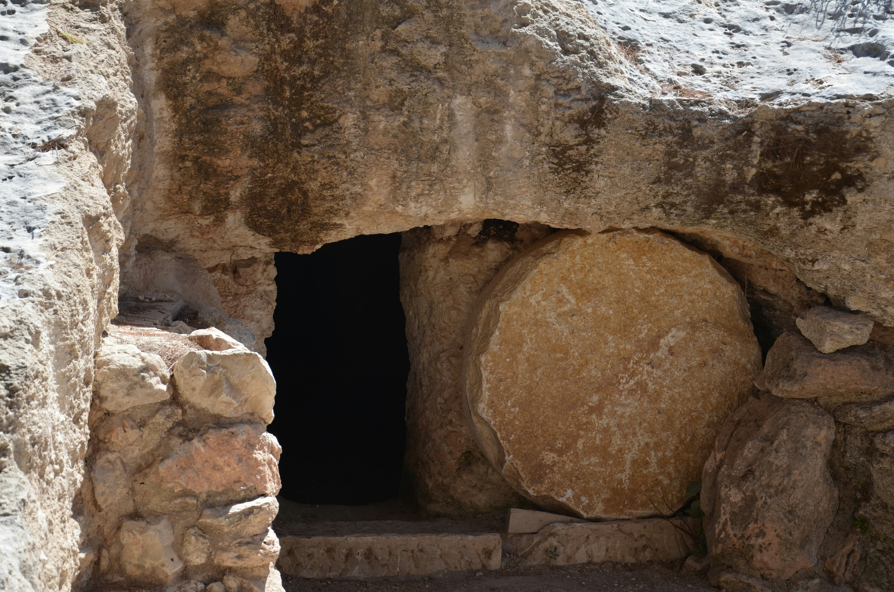
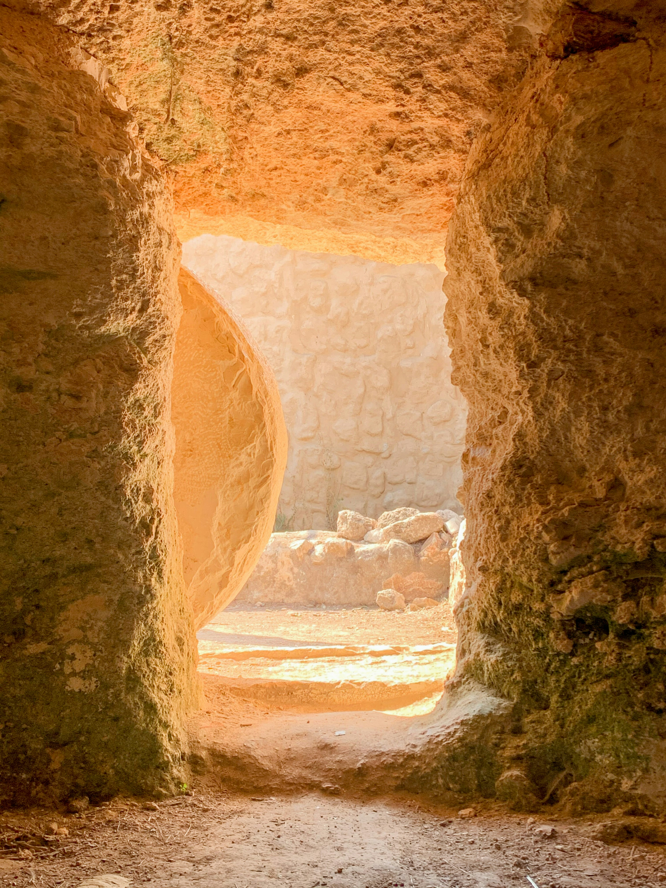

##  {.scrollable background-image="images/thanti-riess-U_b-eSviHvs-unsplash.jpg" background-size="cover" background-color="black"}

\
\
\
\
\

::: {style="text-align: center;"}
<h1>[Emptiness of Easter]{style="color:goldenrod;"}</h1>
:::

## {.center-text}

### *Easter is not just remembrance — it's a turning point.*

:::{.fragment}
{width=500px}

- The resurrection disrupted every assumption the disciples had about what their lives were supposed to look like.

- Empty tomb can be disruption — also reorientation.
:::

## I. Empty Tomb 

### Mark 16:1–6

> When the Sabbath was over, Mary Magdalene, Mary the mother of James, and Salome bought spices so that they might go to anoint Jesus' body... "Don't be alarmed," he said. "You are looking for Jesus the Nazarene, who was crucified. He has risen! He is not here."

- The women came to the tomb expecting to tend to what was **familiar**
- Instead they found emptiness — and a call to **go**, not to linger

## I. Empty Tomb vs. Nest

### "Why do you seek the living among the dead?" — Luke 24:5

- Our homes are quieting — the next question echoing....
- The empty nest is not a loss to grieve endlessly
- It can be a **space God is preparing** for something new

:::{.fragment}
::: {.callout-box}
The tomb was empty not because something was taken away — but because something had been **released**.
:::
:::

## II. Resurrection Means Reorientation

### From old identity to new commission

- The disciples' old identities — fishermen, tax collectors — had already been set aside once when they followed Jesus
- After the resurrection, they were **re-commissioned**
- Same Lord, but a **larger scope**

:::{.fragment}

> "But you will receive power when the Holy Spirit comes on you; and you will be my witnesses in Jerusalem, and in all Judea and Samaria, and to the ends of the earth."
:::

:::{.fragment}

::: {.scripture-ref}
Acts 1:8
:::
:::

## II. Resurrection Means Reorientation

### The calling is not ending — it is expanding

- The season of raising children **was** a calling
- That calling is not over; it is **transforming**

:::{.fragment}

::: {.callout-box}
What gifts, time, energy, and experience has parenting **built in you** that the church and community now need?
:::
:::

- Patience reshaped through more spacious house 
- Wisdom earned through arrows getting sent off (Psalm 127:4)
- Faith tested through letting go

## III. A Call to Serve

### From Nurturing a Household to Nurturing the Body

Parenting cultivated ministry skills in disguise:

- **Patience** — honed over years of repetition and correction
- **Teaching** — explaining faith to curious and skeptical young minds
- **Sacrifice** — daily practice of putting others first
- **Hospitality** — building a home where others feel welcome
- **Mentorship** — walking alongside another person in formation

## III. A Call to Serve

### The church needs what empty-nesting parents carry

::: {.callout-box}
**Wisdom. Availability. Spiritual maturity.**
:::

- Mentoring younger families navigating the stages you've walked
- Leading or hosting small groups
- Investing in youth ministry — your own teenagers gave you the training
- Serving in missions — short-term or long-term
- Community outreach and neighborhood presence

## III. A Call to Serve

### Romans 12:1

> Therefore, I urge you, brothers and sisters, in view of God's mercy, to offer your bodies as a living sacrifice, holy and pleasing to God — this is your true and proper worship.

- This is not a one-time act
- Easter reminds us: it is a **continual re-offering**
- Each new season is an invitation to place ourselves on the altar again

## IV. Reflection

### What feels like an ending is actually a beginning

::: {.reflection}
"As your children grow and leave, what is one area of service or purpose you feel God may be calling you toward — something you couldn't see clearly before?"
:::

 

- Take a few minutes to reflect individually
- Share with the group if you are comfortable

## {.center-text}

### ***The tomb was empty ...  ***

:::{.fragment}
{width=300px}
:::

:::{.fragment}

### ***depending on where you view from***
:::

## {.center-text}

  

### Closing Prayer

 

*Lord, as we celebrate the resurrection,*
*give each of us a resurrection vision for this next season.*

*Show us the emptiness in our lives*
*not as loss, but as space You are preparing.*

*Re-commission us for Your purposes.*

*Amen.*

